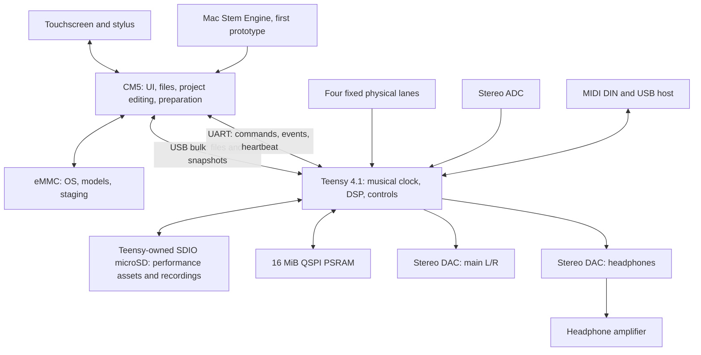
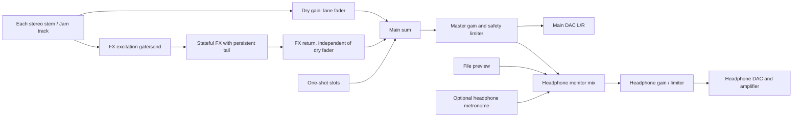

# Processor, audio and storage architecture

## 1. Quantitative architecture comparison

| Architecture | Compute/memory facts | Benefits | Limits / disposition |
|---|---|---|---|
| Teensy 4.1 only; external Mac prepares stems | 600 MHz Cortex-M7, 1 MiB internal RAM, ~7.75 MiB usable program flash; add 16 MiB PSRAM | Lowest compute power; direct controls/audio; preserves firmware | Viable performance prototype. Rich display competes for RAM/bus time. Current Python/MLX separator cannot run here. Not full standalone target |
| Teensy + Raspberry Pi CM5 8 GB | Four Cortex-A76 at 2.4 GHz; 8 GB RAM, 32 GB eMMC chosen | Linux UI/files; isolates rendering from DSP; documented carrier interfaces | RECOMMENDED V1 prototype baseline. No onboard neural accelerator; CPU inference and thermal behavior unproven |
| Teensy + Radxa CM5 8 GB | RK3588S2: four A76 + four A55, up to 6 INT8 TOPS, LPDDR4X/eMMC | More compute domains and potential NPU path | Alternative; RKNN model/operator conversion and BSP maintenance need proof. Not pin-compatible with Raspberry Pi CM5 |
| Teensy + Jetson Orin Nano 8 GB | Six A78AE; 1024 CUDA cores/32 Tensor cores; configurable 7–25 W module modes | Stronger practical CUDA model-runtime path | ML benchmark alternative. Power, cooling and cost substantially higher; 8 GB still not a guarantee |
| Application processor only | Same AP resources, with Linux audio | Removes duplicate storage and MCU board | Requires requalifying deterministic audio/control latency and moving existing firmware; not recommended before two-processor baseline |

Primary sources: [PJRC hardware](https://www.pjrc.com/store/teensy41.html), [CM5 product](https://www.raspberrypi.com/products/compute-module-5/), [Radxa brief](https://dl.radxa.com/cm5/radxa_cm5_product_brief_Revision_1.3.pdf), [NVIDIA developer kit](https://docs.nvidia.com/jetson/orin-nano-devkit/user-guide/latest/). Retrieved 14 Sep 2026 Pacific. Core counts/GHz/TOPS are not comparable application benchmark scores.

**Recommendation logic:** the display and modern model-runtime memory requirements establish a reason for a second processor even before ML timing is known. CM5 is a good first UI/file platform; choosing it permanently for embedded ML would be premature. Freeze the audio/control contract now; defer production AP carrier release until the same model and representative songs run on candidate hardware.

The existing Stem Engine smoke metadata reports 93.04 seconds for a 12-second synthetic staged fixture (RTF 7.75), including that job's execution conditions, with quality_validated=false. This is a local Mac execution check, not a steady-state song benchmark, CM5 forecast or quality ranking.

## 2. Responsibility and topology

The AP may reboot while Teensy continues the current prepared performance, local MIDI and controls. Touch notes stop being available during a UI failure. For stuck touchscreen notes, release only AP-origin voices after heartbeat loss; do not kill DIN-origin notes, playback or FX tails.

### Interprocessor physical choice

Use CM5 USB3 port 0's USB2 D+/D− pair as internal host to Teensy USB device. Use Teensy UART7 independently for bounded command/event traffic. Files are transferred in stopped/preparation states; performance audio never depends on sustained AP USB delivery.

A 1 Mbaud 8N1 UART carries at most 100,000 payload bytes/s before protocol overhead. Even four PCM16 stereo stems need 705,600 B/s at 44.1 kHz. UART is therefore explicitly **not** the audio/file bulk path. USB 480 Mbit/s is signalling speed, not measured throughput; require ≥5 MB/s sustained file transfer before accepting user import-time estimates.

An all-live-USB-stream design would eliminate the extra card copy but couple playback to Linux scheduling, host restarts and queue underflow. A TDM link would need additional clock/synchronization and file communication anyway. These remain alternatives, not the baseline.

## 3. Audio hardware

RECOMMENDED: PCM1863 stereo ADC + two PCM5102A stereo DACs + TPA6130A2 headphone amplifier. Main and headphone buses are independent stereo pairs, clocked by the same Teensy SAI1. Two SAI transmit data lanes carry ordinary stereo I2S. No TDM codec driver is needed for this baseline.

[PCM1863](https://www.ti.com/product/PCM1863) provides a two-channel ADC, PGA and I2C control. [PCM5102A](https://www.ti.com/product/PCM5102A) accepts I2S with BCLK-derived PLL and provides nominal 2.1 Vrms line output. [TPA6130A2](https://www.ti.com/product/TPA6130A2) provides headphone drive and independent volume control. Their data-sheet performance is not a system noise-floor claim.

Prototype uses line-level stereo input and unbalanced main L/R. Target ≥10 kΩ input impedance and nominal full-scale output around 2 Vrms into ≥10 kΩ. Confirm input attenuation/headroom and gain calibration with real signals. Separate main L/R connectors versus one stereo connector remains a mechanical decision. Headphones target clean 32–80 Ω operation first; neither 300 Ω loudness nor very-low-impedance output is promised.

ADC input needs RF filtering, AC coupling/bias per device requirements, protection and a known gain range. A line DAC is not a headphone driver. Size headphone input attenuation so maximum DAC level cannot overdrive the amplifier at its selected supply/gain. Start power-on muted with a conservative digital volume.

Modern alternative: TAA5212 ADC + two TAD5242 DACs (integrated headphone-capable outputs), subject to driver/clock and acoustic comparison. Integrated multichannel alternative: PCM3168APAP, 6 ADC/8 DAC channels, TDM, differential analog stages and extra rails. It offers more I/O than required and a greater driver/analog burden. SGTL5000 shield is a useful two-channel test baseline, but one shield does not prove independent four-channel preview.

## 4. Audio signal flow

The engineering contract locks tail independence, not an undocumented interpretation of new send excitation. Limiter headroom and clipping policies must account for four stems plus samples/FX. Audio Lab owns the actual algorithms and thresholds.

## 5. Clock assumptions

Prototype profile P1: nominal 44,100 Hz, 128 frames/block, PCM16 files, float internal DSP. Block interval = 2.90249 ms; at 600 MHz, 1,741,497 CPU cycles/block. Planning limit: ≤60% worst observed render time (1.741 ms); hard release requirement: no missed audio deadlines under the agreed load and test envelope.

Hardware-ready profile P2: 48,000 Hz, 128 frames/block, 24-bit samples in 32-bit I2S slots; 2.66667 ms/block and 1,600,000 cycles/block. P2 is OPEN, not silently substituted for firmware P1.

Teensy is sole MCLK/BCLK/LRCLK master. At 64 BCLK/frame: 2.8224 MHz (P1) or 3.072 MHz (P2). With chosen 256fs MCLK: 11.2896 or 12.288 MHz. Validate the installed driver actually uses these ratios, ADC PLL configuration and physical LRCLK rate. The stock Audio library rate constant, effective PLL rate and asset rate must be reconciled; never infer exact pitch merely from a “44.1k” label.

AP wall clock and USB frame timing do not clock audio. MIDI clock disciplines musical phase/tempo, not the sample oscillator. Sample-rate changes require stopped transport, queue drain, mute, clock reconfiguration and a new stream epoch. End-to-end latency includes converter group delays, queues and smoothing; “one block” is not an analog round-trip claim.

## 6. Storage calculations

Decimal MB below; MiB = 1,048,576 bytes. Worst case assumes all stems stereo.

| Profile | Four stems read | 4-minute set | Plus stereo record + stereo preview |
|---|---:|---:|---:|
| 44.1k / PCM16 | 4×2×44,100×2 = 705,600 B/s | 169.344 MB | 1.0584 MB/s |
| 48k / packed PCM24 | 1,152,000 B/s | 276.480 MB | 1.728 MB/s |
| 48k / FLOAT32 or padded 32-bit | 1,536,000 B/s | 368.640 MB | 2.304 MB/s |

These omit extra sample voices and audio loops; each additional 48k stereo PCM24 stream adds 288 kB/s. Four stereo recorded loops would add 1.152 MB/s. Define the final concurrency envelope before claiming capacity.

Minimum qualification target: ≥8 MB/s application-level mixed I/O at the selected block sizes, plus stall characterization. Class/UHS labels alone do not qualify a card for concurrent random reads and writes. Keep four files open, preallocate recordings, use large aligned sequential reads, and prohibit bulk browsing/copying/deleting while recording.

A 1 MiB combined P1 stem buffer covers 1.486 seconds; 512 KiB record buffer covers 2.972 seconds at stereo PCM16. Adopt a preliminary 250 ms worst-stall test target, not a guarantee about every SD card. Scheduler must refill all stems fairly, track low-water marks, and never block in the audio interrupt.

MicroSD is always owned by Teensy. CM5 sends directory/file requests to it; no two processors mount the same FAT volume. CM5 eMMC holds OS/models and staging, not the only copy of an active performance. Existing user requirement to browse the Teensy card is preserved.

## 7. Memory reservations

Planning allocations, not linker measurements:

| Region | Reservations | Remaining / conditions |
|---|---|---|
| 512 KiB FlexRAM shared ITCM/DTCM | 192 code; 160 DSP state; 64 queues; 32 stack = 448 KiB | 64 KiB guard; code/data partition must match actual link |
| 512 KiB OCRAM (“RAM2”) | 96 DMA; 128 SD caches; 64 USB; 32 control/state = 320 KiB | 192 KiB guard; DMA buffers aligned/coherent |
| 16 MiB PSRAM | 1 stem ring; 0.5 recording; 6 delay; 4 samples; 2 loop cache = 13.5 MiB | 2.5 MiB guard; these are explicit caps |
| 8 GB CM5 | OS/UI allowance 1.5 GB; staging 0.5 GB; ML working-set target ≤5 GB | ~1 GB headroom; measure RSS plus GPU/shared allocation |

6 MiB at float stereo 48k holds 16.384 seconds of total delay, or 4.096 seconds per lane if divided equally; it is not four 16-second delays. Four 8-second stereo float loops need 12.288 MB, so long audio looping must stream to SD. A 4-minute, 48k stereo float song is 92.16 MB; mixture plus four outputs already occupy 460.8 MB before models, residuals, tensors or copies.

PSRAM is for capacity, not deterministic single-cycle access. Stage time-critical blocks in internal memory; qualify cache misses with DSP and SD/USB active. Never use a successful 16 MiB allocation as proof the effects workload meets deadlines.

## 8. Display bandwidth and system contract

An 800×480 RGB565 framebuffer uses 768,000 bytes (750 KiB); double buffering uses 1,536,000 bytes, beyond Teensy's entire internal RAM. At 30 complete frames/s, pixel writes alone are 23.04 MB/s or 184.32 Mbit/s. A hypothetical 40 MHz SPI link provides at most 5 MB/s before overhead: ~6.5 complete frames/s. Partial redraw and controller-local rendering can improve an MCU-only design, but do not remove the memory/interaction qualification requirement.

At 1280×720 RGBA8888, one buffer is 3,686,400 bytes and double buffering ~7.37 MB, modest in an 8 GB AP. Full raw RGB888 active pixels at 60 Hz are 1.327 Gbit/s before blanking and link overhead. DSI lane count/rate must be sized from the selected panel timings, not only resolution.

RECOMMENDED system boundary: CM5 owns DSI, touch I2C/USB, backlight and rendering. Teensy receives semantic note/control events, not pixel traffic. Reserve 3 W display/touch power initially; a panel that exceeds it triggers power-budget revision. Display + Controls owns screen size, multitouch/pen capability, viewing performance and finger/stylus tests. Do not promise active-pen precision from a generic capacitive screen.
