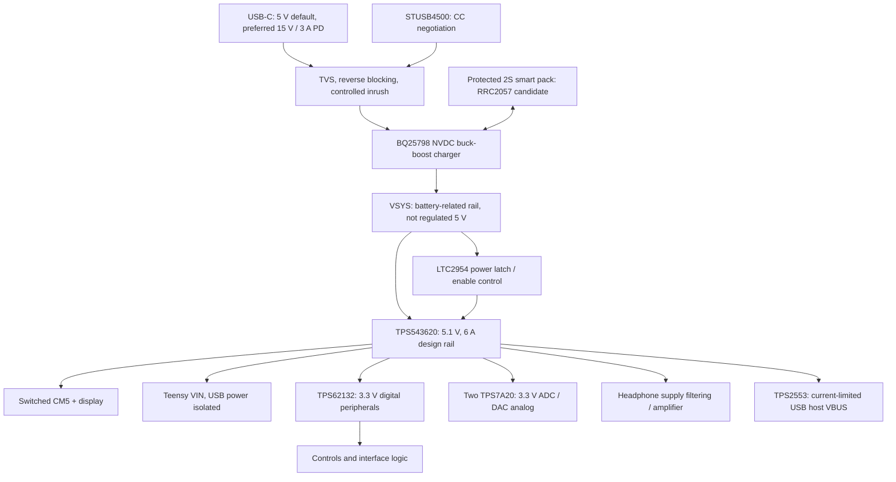

# Power, protection and physical implementation
Revision 0.1 • RECOMMENDED architecture; battery/charger pairing NEEDS BENCHMARK and pack qualification.

## 1. Power tree

RRC2057 candidate: nominal 7.2 V ×6.9 Ah = **49.68 Wh**, maximum charge voltage 8.4 V, manufacturer maximum charge/discharge currents 4.83/9.5 A, weight 230 g. It requires an SMBus-compliant charger. Those are pack limits, not selected charging settings. [RRC2057 manual, English p4](https://www.rrc-ps.cn/fileadmin/documents/Manuals/Manual_RRC2057_H.pdf)

BQ25798 provides 1–4-cell buck-boost charging/power-path management and I2C control; STUSB4500 performs USB PD negotiation. **Neither “USB PD compatible” charger silicon nor a Type-C receptacle independently negotiates the desired contract.** [BQ25798](https://www.ti.com/product/BQ25798), [STUSB4500](https://www.st.com/en/interfaces-and-transceivers/stusb4500.html)

### Charging and startup policy

- Prefer 15 V /3 A (45 W) sink contract; also support 9 V and 5 V fallbacks. Never assume 3 A from a legacy source without current advertisement/negotiation.
- Select 2S charger hardware defaults. Hold charge disabled until pack identity, temperature, requested charge voltage/current and safety flags have been read. A fixed 8.4 V setting alone does not satisfy the RRC smart-battery contract.
- Initial charge target ≤2 A, additionally limited by pack request, temperature, input contract and remaining system power. Firmware does not disable pack protection.
- Set charger input limit conservatively before full-load startup; AP/display stay gated until a valid source or sufficiently charged pack exists.
- With no/low battery and a weak 5 V source, charge first or offer reduced-power operation. Do not brownout-loop trying to start the AP.
- Use independent pack protection/balancing and host shutdown before the pack's hard cutoff. BQ25798 is not a substitute for cell balancing/protection.
- Disable unused MPPT and OTG functions. USB host 5 V comes from the regulated rail; do not allow charger OTG to source the charging port accidentally.
- Pack SMBus adaptation, temperature inputs, charger watchdog/default register behavior and a safe no-firmware state must be verified before cell connection. Use battery simulator/EVM first; use the manufacturer's charger for early pack experiments.

BQ25792 remains a simpler alternative in this family, but its direct datasheet fetch was unavailable during this review. It is not treated as a wiring-verified drop-in.

## 2. Rail sizing

| Rail | Proposed capacity | Loads / key constraint |
|---|---:|---|
| VSYS | ≥35 W short-term design envelope | 2S pack-related, ~6–8.4 V in normal battery operation; upstream design must survive plug transients |
| 5.1 V system | 6 A regulator design, 30.6 W nominal ceiling | CM5, display, Teensy, headphone rail, downstream regulators and USB |
| 3.3 V peripheral | 3 A-capable TPS62132, actual budget ≤0.5 A initially | Panel, DAC digital/logic, interface buffers; not tied to Teensy or CM5 regulator outputs |
| 3.3 V analog A | ≤0.10 A target | ADC and local analog parts |
| 3.3 V analog B | ≤0.15 A target | Two DAC analog/charge-pump loads; confirm measured consumption |
| Teensy onboard 3.3 V | Board/PSRAM plus conservative extra load | Do not power screen/codec board from its accessory output |
| CM5 generated rails | Module-owned | Do not parallel with external 3.3 V or energize before CM5 5 V |

[TPS543620](https://www.ti.com/product/TPS543620) is a 4–18 V, 6 A buck; [TPS62132](https://www.ti.com/product/TPS62132) is the 3.3 V variant (TPS62133 is 5 V and is **not** the specified 3.3 V part). [TPS7A20](https://www.ti.com/product/TPS7A20) is a low-noise 300 mA LDO family.

Choose buck UVLO with real dropout, wiring and transient margin. At 6.0 V input, 5.1 V output requires ~85% ideal duty; near 5.4 V it approaches the regulator duty limit. Shut down well before losing the regulated rail. Battery gauge/load sag determines final thresholds; nominal cell voltage is not a UVLO threshold.

At 5.1→3.3 V, a 0.15 A analog LDO dissipates 0.27 W. Check junction rise using the actual package/PCB copper; the 300 mA electrical rating does not establish safe dissipation in a small package.

CM5 must see 4.75–5.25 V at its module pins, including load steps. Design target 5.1 V with tolerance/transient analysis; scope at the module, not only regulator pads. CM5 supply sequencing prohibits powering GPIO ahead of its 5 V rail. Use power-off-protected buffers and open-drain control of its 5 V-pulled-up system pins. [CM5 datasheet](https://datasheets.raspberrypi.com/cm5/cm5-datasheet.pdf)

## 3. Estimated operating and battery budget

These are load allowances for design, not manufacturer “typical” readings or measured runtime.

| Load | Idle/edit | Performance | Preparation stress |
|---|---:|---:|---:|
| CM5 | 3.0 W | 4.5 W | 12.5 W |
| Display/touch/backlight | 2.0 | 3.0 | 3.0 |
| Teensy + PSRAM | 0.6 | 0.9 | 0.9 |
| Audio analog/DACs/headphone | 0.4 | 0.7 | 0.7 |
| Removable card activity | 0.2 | 0.6 | 0.6 |
| Controls/status/interface | 0.2 | 0.3 | 0.3 |
| **Load total, no external USB** | **6.4 W** | **10.0 W** | **18.0 W** |
| External USB allowance | +0 to 2.5 W | +0 to 2.5 W | +0 to 2.5 W |

Model battery-to-load efficiency 88%, usable pack energy 80% of nominal (aging/reserve/temperature combined planning factor). Available load energy =49.68×0.8×0.88=34.97 Wh. Estimated runtime: **5.46 h idle/edit, 3.50 h performance, 1.94 h preparation**, or 2.80 h performance with a full 2.5 W USB peripheral. Actual pack fit, runtime requirement and workload must be agreed.

At 20.5 W load and 6 V pack, 88% efficiency implies ~3.88 A pack current. At the 30.6 W rail ceiling it approaches 5.8 A before other losses. These are sizing cases, not allowed sustained thermal operation.

A 45 W PD source with assumed 90% front-end efficiency yields ~40.5 W available at system/battery. An 18 W preparation load plus 8.4 V×2 A charge =34.8 W fits that estimate; charge must back off during load peaks. 9 V×3 A or 5 V×3 A cannot promise the same charge-while-running behavior. A 2 A charge on 6.9 Ah takes at least 3.45 h plus constant-voltage taper and load/thermal throttling.

Teensy-only with a similar display may be roughly 3–5 W total, but display-controller choice dominates and this estimate needs measurement. Jetson's 7–25 W module modes replace the CM5 row, not the whole-device budget; it needs a different thermal/power qualification.

## 4. Thermal constraints

Propose performance operation without audible fan cycling. Provide a heat-spreader path from AP to an enclosure region separated from the battery and analog board. Keep fan option for early AP/ML tests; final fanless viability is NEEDS BENCHMARK.

At 18 W load, 88% aggregate efficiency implies about 2.45 W conversion loss in addition to load heat. Much of the compute/display energy becomes heat inside the enclosure. Without enclosure surface area/material/ambient requirements, no defensible junction or touch-temperature prediction is possible.

Measure at 25°C and proposed 40°C ambient with closed representative enclosure, sustained load and simultaneous charging. Record processor throttle state, regulator/inductor temperatures, battery temperature and audio noise. Respect pack charge temperature limits; never use throttling alone as the battery protection mechanism.

## 5. Ports and electrical protection

- **USB-C:** separate CC negotiation, VBUS protection and data paths. Proposed connector GCT USB4105-GF-A; verify current rating/footprint. Prefer only 3 A PD profiles to avoid a 5 A cable dependency. CM5 CC pins remain disconnected from external CC in this topology.
- **Internal USB:** short controlled-impedance link; no flywire stubs or simultaneous PC/AP host connection. Isolate Teensy VIN from VUSB per PJRC instructions when self-powered; preserve VBUS sense and never backfeed either host.
- **USB host:** one USB-A receptacle from Teensy host, protected current limit and fault reporting. Device enumeration/power behavior must be tested with actual controllers.
- **DIN MIDI:** optoisolated current-loop input, buffered compliant output, 31,250 baud. Candidate 6N138 with its supply/output interface designed for 3.3 V MCU; verify propagation and current threshold at both legacy and modern transmitter limits. Do not connect DIN straight to GPIO. Use official [2014 electrical specification](https://www.midi.org/wp-content/uploads/wpforo/default_attachments/1709416667-ca33-MIDI-10-Electrical-Specification-Update.pdf); final resistor/opto circuit is a schematic task.
- **Audio:** connector-side low-capacitance protection, RF filters and appropriate series impedances. Headphone load and contact shorting during insertion must not destabilize the amplifier. Jack-detect line is protected/debounced.
- **Power:** input TVS sized for negotiated VBUS and surge, reverse blocking, fuse/current limiting, ESD paths and inrush limiting. TPS25947 is a low-voltage rail option, **not** protection to place directly on a 15 V PD input.
- **SD/debug/panel:** protect user-accessible contacts; key connectors and put ground adjacent to fast signals. Do not use an MCU pin's clamp diode as an ESD design.

## 6. Grounding and PCB partitioning

RECOMMENDED three serviceable assemblies: compute/power carrier, audio board near audio jacks, and fixed-layout controls/display assembly. Keep high-current charging/inductor loops short and away from ADC inputs, DAC reference/charge-pump loops and fader returns.

Use continuous ground planes and controlled return paths; partition placement and power branches rather than cutting arbitrary analog/digital ground moats. Never route clocks or USB over a split. Terminate cable shields/ESD to chassis/entry strategy with short paths; decide chassis-to-circuit bonding through EMC testing. Headphone output return currents should not share narrow ADC/input ground traces.

Main carrier likely 6 layers for SoM connectors/high-speed interfaces and power integrity; analog/control boards may use 4 layers. This is an estimate, not a released stackup. Use impedance targets from chosen CM5/panel design rules and fabricator capabilities.

Prototype boards use modules/EVMs and accessible connectors. Production retains CM5/Teensy modules initially to avoid DDR/BGA and boot-chain redesign. A later bare RT1062 board requires oscillator, flash, regulators, boot/debug and licensed/supported programming strategy; Teensy-compatible software is not proof a copied bare MCU board will boot.

Use mechanically supported replaceable faders/encoders, test points on rails/clocks/mute, keyed harnesses, accessible Program/recovery, serial-number and calibration storage, and a factory loopback test. Final connector positions, fader travel and enclosure dimensions wait for mechanical work.

